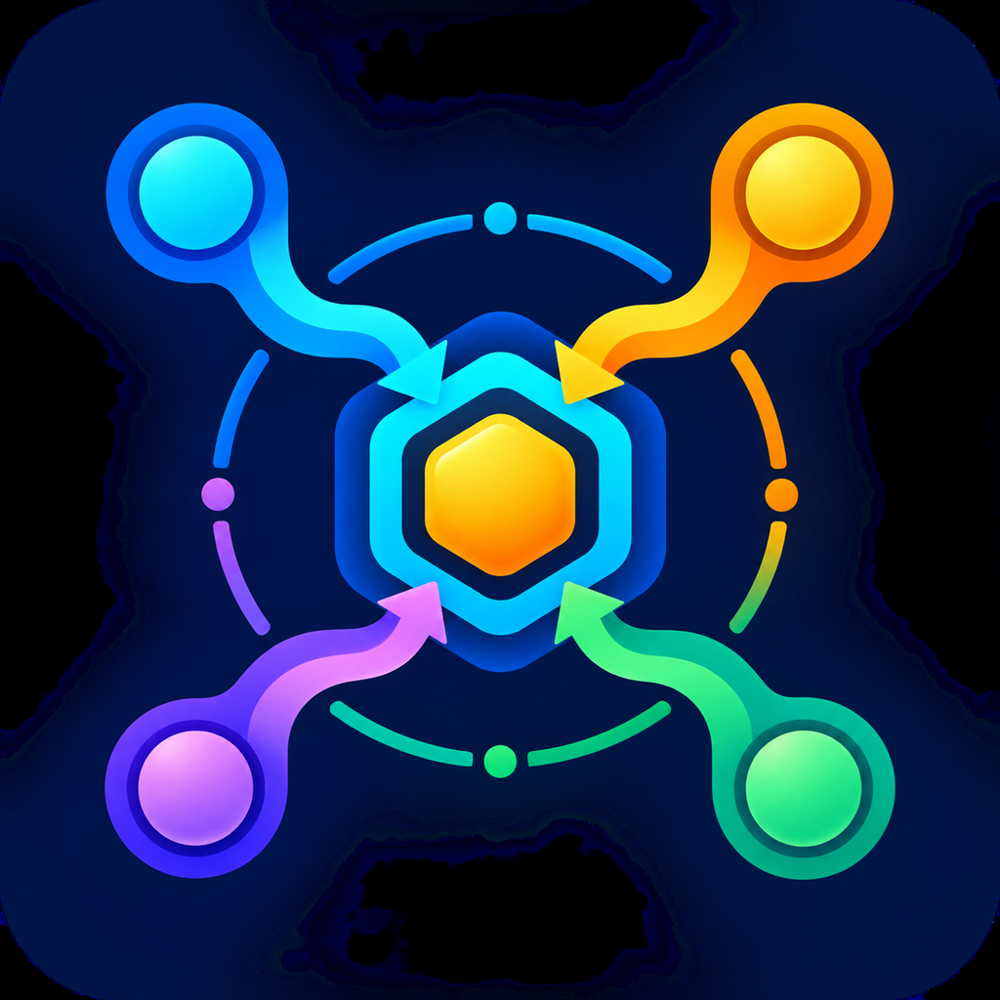

# Give the Controller the objective. Stop managing every Pro chat yourself.

**Pro Collaboration Controller automates the coordination around your own subscription ChatGPT Pro.** After you authorize one objective, it can prepare compact tasks, route work to suitable Pro conversations, observe progress, collect results, decide the next action, and create recoverable handoffs when the host exposes the required tools.

You keep control of the goal and material authorization. The Controller manages the collaboration. Pro performs the substantive work.

## What it automates

- understands the deliverable, constraints, and acceptance conditions;
- assigns planning, worker, challenge, specialist, and review roles;
- creates or reuses suitable Pro conversations when the product surface permits;
- sends minimum-context task cards and avoids copying the full history;
- observes progress without wasteful high-frequency polling;
- accepts, revises, stops, or hands off returned candidate work;
- preserves accepted facts, closed routes, and exactly one next action.

## Fast by default

“Work with Pro to finish this task” starts the smallest useful route: one verified Chat + Pro conversation, one compact task, one result, and at most one repair. Multiple Pro roles, Projects, research gates, route audits, handoffs, Goals, and Scheduled Tasks activate only when an observed trigger requires them.

## No protocol forms

Users speak naturally. Internal task cards, IDs, hashes, and YAML are compiled and validated by the Controller, not filled in by the user. Even when a research search escalates one real blind spot to Pro, the default interface shows only the plain-language action, obstruction, or audited result.

## 不用再充当多个 Pro 之间的“人工传话员”

你只需要说明最终目标、限制和必要授权。Controller 会在可用工具范围内自动安排 Pro 对话、发送精简任务、收取结果、要求修改、停止错误路线，并把已接受成果交给下一位 Pro。

> 你和 Pro 配合，把这个任务做完。

就这么简单。你不需要先决定用几个 Pro，也不需要自己安排分工、复核、上下文压缩或对话交接。

它不会把完整历史反复塞给每个对话，而只传递已接受事实、未决问题、关键证据、失败路线的准确阻碍和唯一下一步。这可以减少重复上下文、重复工作和无效等待。

## Honest automation boundaries

The decision core remains a lightweight Skill, not an independent 24/7 server. For authorized work that must resume later, it prefers a real completion event and may use one same-chat Scheduled Task when the host supports it. A wake-up can only read status and decide; it never sends or resends the task. Unobservable state fails closed.

It prefers first-party thread tools for established conversations and uses the browser only for remaining product-UI gaps such as new-chat creation, Pro selection, a first message, or an unavailable attachment download. If an operation cannot be performed, it produces a manual handoff instead of claiming success.

The plugin never silently substitutes a non-Pro model or paid API. Any fallback requires explicit authorization and an execution receipt. It does not promise a fixed token-saving percentage, a particular internal model identity, or correct research results. Pro outputs remain candidate work that must be checked before consequential use.

This is an independently developed third-party plugin. It is not made, supported, certified, or endorsed by OpenAI. ChatGPT, Codex, OpenAI, and related marks belong to their respective owners.

## Public documents

- [Privacy notice](privacy.html)
- [End user terms](terms.html)
- [Support](support.html)
- [Personal and Evaluation License 1.0](license.txt)

Publisher: **knockknock-hoho**
